# My CookBook

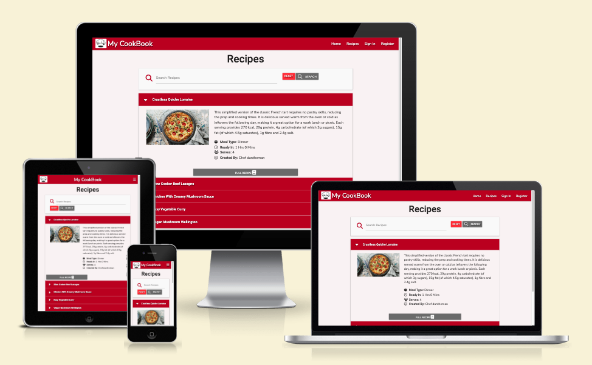

My CookBook is an interactive recipe web application, designed for users wanting to create, search for, edit and delete recipes.

The main goal for this application is to offer a fun and personalised experience for the user, giving them the ability to contribute their own recipe ideas to the online cooking community, whilst also allowing them to save ideas for their own use.

Visit the deployed site [here](https://my-cook-book-dh-6fcf65fd1fe5.herokuapp.com/).

---

# User Experience (UX)

## Project Goals

- The application can be easily navigated and understood.
- Clearly explains the concept of the application.
- Clearly explains how to use the application.
- Contains clear imagery and content.
- Provides interactivity in the form of clickable elements.
- Provides feedback when the user performs a specific function.
- Provides users with the ability to create their own profile.
- Provides users with the ability to 'Create' their own recipe.
- Provides users with the ability to access a wide range of recipes and view their full content ('Read').
- Provides users with the ability to edit ('Update') recipes they have created.
- Provides users with the ability to 'Delete' recipes they have created.
- Provides users with the ability to search all recipes depending on keyword.
- Provides users with the ability to save recipes and add them to their 'CookBook'.
- Provides users with the ability to remove recipes from their 'CookBook'.
- The game can be played on a variety of screen sizes.

## User Stories

- As a user, I want to be able to navigate the application easily, so that I can start using the application as soon as possible.
- As a user, I want to know what the application is about, so that I can understand the concept behind it.
- As a user, I want to see the application's instructions, so that I can understand how to use it.
- As a user, I want to be able to interact with the application, so that I can have a enjoyable experience.
- As a user, I want to be given feedback when I interact with the application, so I know when an action I perform has been registered.
- As a user, I want to be able to create my own profile, so I can begin using the application to its fullest.
- As a user, I want to be able to add my own recipes, so I can share my knowledge with others.
- As a user, I want to be able to access a wide range of recipes, so that I can find something that I like.
- As a user, I want to be able to edit my own recipes, so that I can make changes to the recipe or fix errors if needed.
- As a user, I want to be able to delete my own recipes, so that I can remove my information if I change my mind.
- As a user, I want to be able to search for a specific recipe, so that I can see which recipes suit my preferences.
- As a user, I want to be able to save recipes to my profile, so that I can view only the recipes that matter to me.
- As a user, I want to be able to remove recipes from my profile, so that I can view only the recipes that matter to me.
- As a user, I want the web application to be responsive, so that I can use the application on a variety of screen sizes.

## Colour Scheme

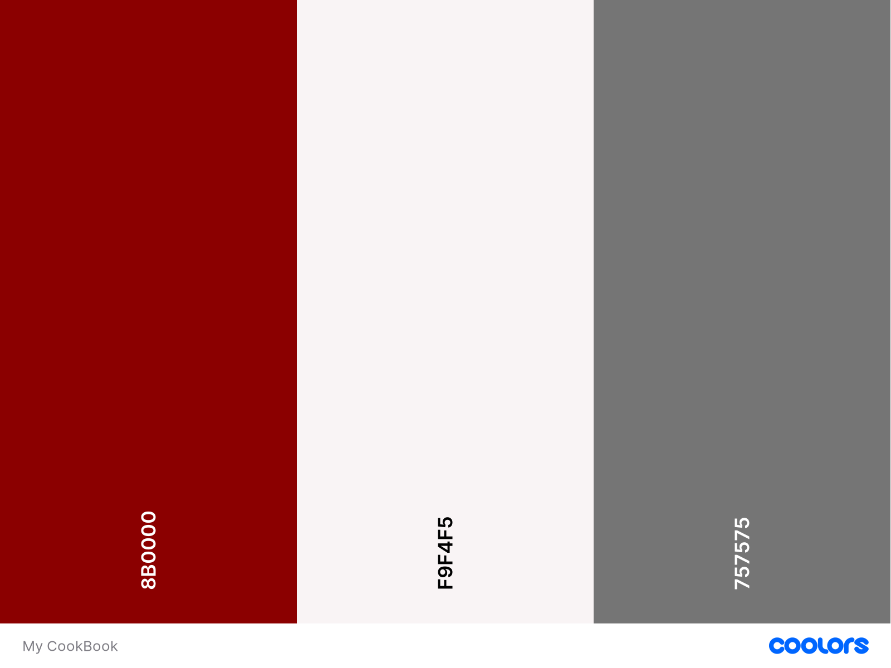

The primary colours used for this application are as follows:

- Dark Red (#8B0000) - for the navbar, collapsible headers, and the large 'Sign In' and 'Register' buttons.
- Snow (#F9F4F5) - for the background to each page.
- Gray (#757575) - for all small buttons*.

*Other secondary colours are used for specific action buttons:

- Red (#F44336) - for the 'Delete' button.
- Light Blue (#42A5F5) - for the 'Edit' button.
- Green (#4CAF50) - for the 'Save' button.
- Orange (#FF9800) - for the 'Forget' button.

## Typography

The font-families used for this application are 'Nunito Sans' for the headers and 'Roboto' for the main body of text, with sans-serif as a fallback for both.
The inspiration for this font pairing came from [this website](https://www.fontpair.co/all).

## Wireframes

[Figma](https://www.figma.com/) was used to develop the initial concept of the main page of the application - the 'Recipes' page. The developer wanted to keep the main layout of this page a common theme across other pages of the application. However, the ideas for other pageds were conceived as the project grew.

Page | Wireframe
--- | ---
Recipes | 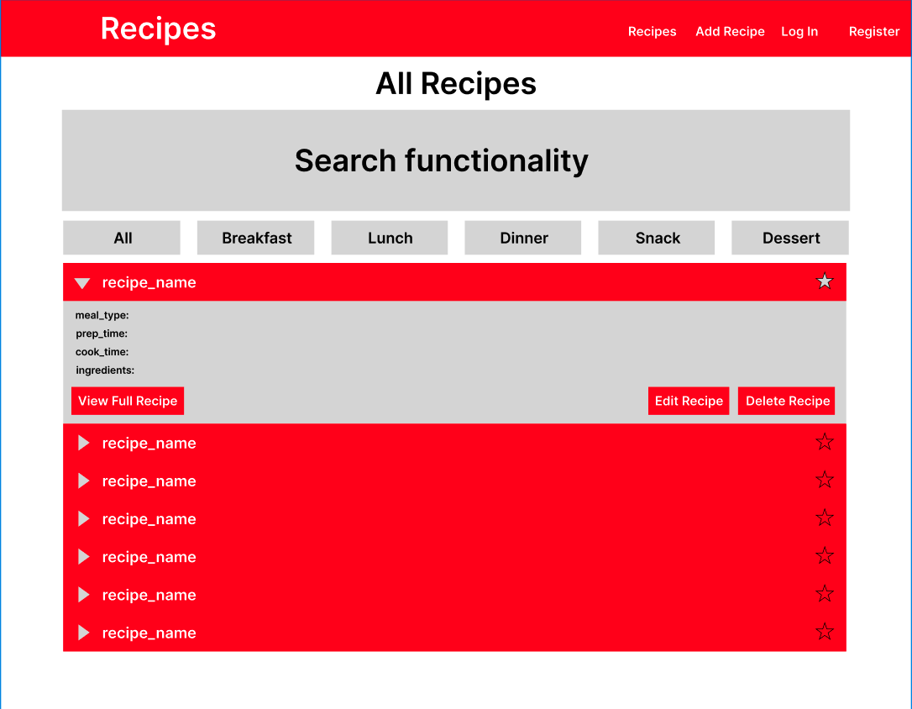

# Database Schemas

The database used for this application is stored in the non-relational database __MongoDB__, which is known for using a "schema-less" or "schema-flexible" modeling concept. The reason behind the choice to use a non-relational database for this application was that the relation between each data-model wasn't as complex as - and didn't need to be manipulated like - a relational database data-model.

Please see below for examples of each data-model.

## Users

<details>
<summary>Model</summary>

- `_id`: ObjectId (Automatically generated unique identifier)
- `username`: String (User's chosen username)
- `password`: String (User's password - this is hashed, using Werkzeug's Security Helper 'generate_password_hash')
- `my_cookbook`: Array (User's saved recipes - this array is empty upon user-creation)
  - `0`: String (ObjectID of recipe)
  - `1`: String (ObjectID of recipe)
  - `2`: String (ObjectID of recipe)

</details>

<details>
<summary>Example</summary>

```json
{
  "_id": ObjectId("659153d1b9ce951d2bdf6597"),
  "username": "exampleuser123",
  "password": "scrypt:32768:8:1$ZbOMTxq9TMnRiLev$3...",
  "my_cookbook": {
    0: "6591544fb9ce951d2bdf6598",
    1: "6591545bdd6d1822d9e9d4c3",
    2: "65915467dd6d1822d9e9d4c4"
  }
}
```

</details>

## Meal Types

This schema is used primarily for users to categorise the recipes they add to the database. It is also a way for users to search for different meal types using the Search bar on the Recipes page.

<details>
<summary>Model</summary>

- `_id`: ObjectId (Automatically generated unique identifier)
- `meal_type`: String (type of meal, i.e. breakfast)
</details>

<details>
<summary>Example</summary>

```json
{
  "_id": ObjectId("659153d1b9ce951d2bdf6597"),
  "meal_type": "breakfast"
}
```

</details>

## Recipes

This is the main schema in which information about recipes is stored. Each key in the schema is manipulated in different ways, such as:

- `_id`
  - Render each recipe in the collapsibles on the Recipes page and Profile page.
  - Add the recipe to the user's CookBook when they click the 'Save' button on a recipe.
- `recipe_name`
  - Render the name of the recipe in the collapsible header and full-recipe page header.
  - Searchable in the search bar on the Recipes page.
- `recipe_desc`
  - Render the description of the recipe in the collapsible body and full-recipe page.
  - Searchable in the search bar on the Recipes page.
- `meal_type`
  - Render the meal type of the recipe in the collapsible body and full-recipe page.
  - Searchable in the search bar on the Recipes page.
- `serves`
  - Render the serving size of the recipe in the collapsible body and full-recipe page.
- `ready_in`
  - Render the serving size of the recipe in the collapsible body and full-recipe page.
- `ingredients`
  - Render each individual ingredient in an unordered list on the full-recipe page.
- `method`
  - Render each individual method step in an ordered list on the full-recipe page.
- `created_by`
  - Render the creator of the recipe in the collapsible body and full-recipe page.
- `recipe_img`
  - Render an image of the recipe in the collapsible body and full-recipe page.

<details>
<summary>Model</summary>

- `_id`: ObjectId (Automatically generated unique identifier)
- `recipe_name`: String (Recipe Name)
- `recipe_desc`: String (Recipe Description)
- `meal_type`: String (Meal Type)
- `serves`: String (Serving Size)
- `ready_in`: Object (Time to prepare & cook)
  - `hours`: String
  - `minutes`: String
- `ingredients`: Array (Individual ingredients)
  - `0`: String (First ingredient)
  - `1`: String (Second ingredient)
  - `2`: String (Third ingredient)
- `method`: Array (Individual method steps)
  - `0`: String (Step 1)
  - `1`: String (Step 2)
  - `2`: String (Step 3)
- `created_by`: String (User who created the recipe)
- `recipe_img`: Object ('src' and 'alt' of the image provided)
  - `src`: String
  - `alt`: String

</details>

<details>
<summary>Example</summary>

```json
{
  "_id": ObjectId("6591596add6d1822d9e9d4c5"),
  "recipe_name": "Crustless Quiche Lorraine",
  "recipe_desc": "This simplified version of the classic French tart...",
  "meal_type": "dinner",
  "serves": "4",
  "ready_in": { "hours": "1", "minutes": "0" },
  "ingredients": [
    "low-calorie cooking spray",
    "8 lean bacon rashers, all visible fat removed and roughly chopped",
    "1 onion, finely chopped",
    "6 large free-range eggs",
    "100g/3½oz half-fat Cheddar, grated",
    "2 tbsp chopped fresh tarragon",
    "2 tbsp finely chopped fresh chives",
    "100g/3½oz cherry tomatoes, halved or quartered",
    "salt and freshly ground black pepper",
    "crisp green salad, to serve"
  ],
  "method": [
    "Preheat the oven to 180C/160C Fan/Gas 4.",
    "Spray a large frying pan with low-calorie cooking spray...",
    "Whisk the eggs in a wide bowl and stir in half the cheese...",
    "Lightly spray a 20–22cm/8–8½in round ovenproof dish or non-stick pie tin..."
  ],
  "created_by": "dantheman",
  "recipe_img": {
    "src": "https://ichef.bbci.co.uk/food/ic/food_16x9_1600...",
    "alt": "Image of Crustless Quiche Lorraine recipe."
  }
}
```
</details>

## CRUD Functionality

The main purpose of this application is to privide users with the ability to Create (add), Read (locate, search for), Update (edit) & Delete (delete, remove) records.

## Create

- Users can create their own account in order to start using features such as adding a recipe, saving a recipe, etc.
- Users can create their own recipe to be shown on the main Recipes page and in their profile.

## Read

- Users can search for specific recipes using the Search bar on the Recipes page.
- Users can view the full version of the recipe using the Full Recipe button on a recipe collapsible.

## Update

- Users can edit a recipe they have created.

## Delete

- Users can delete a recipe they have created.
  - A pop-up/modal has been used in this instance, in order to utilise the benefits of defensive programming.
- Users can remove a recipe from their saved recipes (the 'My CookBook' tab in their profile).

# Features

- The application was designed from a mobile-first perspective.
- The application is responsive on all screen sizes:
  - This allows the user to [view the website on a variety of screen sizes](#user-stories).

## Navbar

There are two different navbars depending on whether or not a user is logged in.

The Navbar is present on all pages in the application.

### User Navbar


The User Navbar consists of:

- __Logo/Title__ - These are both clickable elements and take the user to the Home page.
- __Home__ - This takes the user back to the Home page where information about the application is shown.
- __Recipes__ - This takes the user to the section where all recipes are listed and the user can search for recipes.
- __Add Recipe__ - This takes the user to a page where they can add a recipe.
  - _Users won't be able to add/edit/delete a recipe if they are not logged in._
- __Sign Out__ - This signs the user out of their account.
- __Profile__ - This takes the user to their profile, where they can see recipes they have created as well as recipes they have saved.

### Non-User Navbar


The Non-User Navbar consists of:

- __Logo/Title__ - These are both clickable elements and take the user to the Home page.
- __Home__ - This takes the user back to the Home page where information about the application is shown.
- __Recipes__ - This takes the user to the section where all recipes are listed and the user can search for recipes.
- __Sign In__ - This takes the user to the Sign In page.
  - An option to Register is provided underneath the Sign In section if no account is found.
- __Register__ - This takes the user to the Register page.
  - An option to Sign In is provided underneath the Register section if no account is found.

## Home

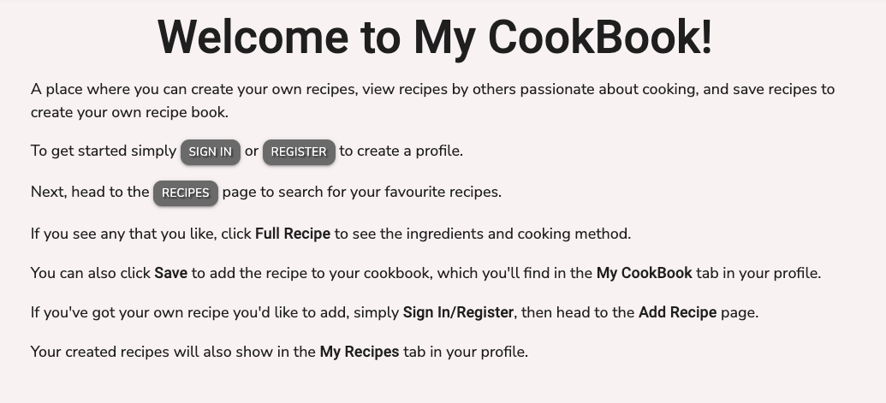

The Home page consist of the following:

- Heading.
- Information about the application and how to use it.
- Several clickable buttons which link to their respective pages:
  - __Sign In__ - This takes the user to the Sign In page.
  - __Register__ - This takes the user to the Register page.
  - __Recipes__ - This takes the user to the section where all recipes are listed and the user can search for recipes.

## Recipes

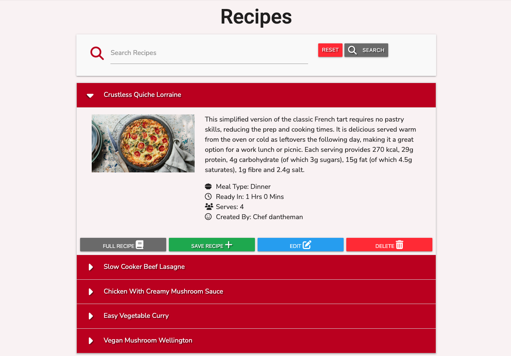

This is the main page of the application. Here users will be able to search for any recipes stored in the application, perform actions such as saving, editing, deleting and viewing the full versions of the recipes.

### Search Bar

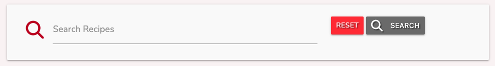

- This feature allows the user to search for a specific recipe using keywords they type into the search bar.
- The __Reset__ button will cancel the search and clear the search bar.
- Users can click __Search__ or simply hit Enter on their keyboard.
- If no results were found from the keyword/s the user has searched for, the following message appears:
  - __"No Recipes Found"__

### Recipe Collapsible

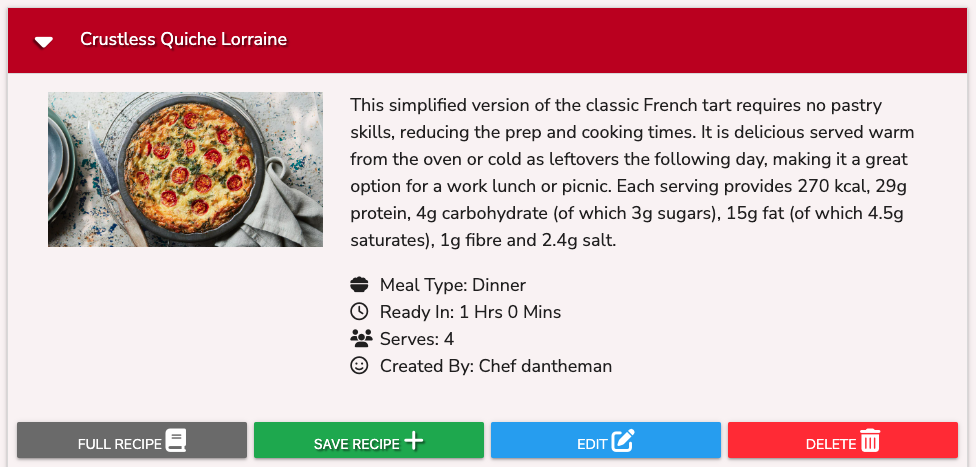

These collapsible elements are where each recipe is displayed from the database. Each collapsible consists of the following:

#### Header

- Includes the recipe name.
- Is a clickable element, which expands or collapses the body of the element.

#### Body

- An image of the recipe (if provided by the user when the recipe has been added).
- A description of the recipe.
- Meal type, i.e 'Lunch', 'Dinner', etc.
- Time to prepare and cook the recipe.
- Number of servings.
- Creator of the recipe.

#### Action Buttons

There are a total of 5 action buttons that will be displayed on the collapsible, depending on a number of factors (please see below for details). However, here are the main functions of each button:

- __Full Recipe__ - Takes the user to a page displaying the full recipe, including the _Ingredients_ and _Method_.
- __Save Recipe__ - Adds the recipe to the user's CookBook, which displays in the _My CookBook_ section of the user's profile.
- __Forget Recipe__ - Removes the recipe from the user's CookBook.
- __Edit__ - Takes the user to the Edit Recipe page where they can edit the recipe.
- __Delete__ - Once clicked, opens a modal asking the user if they're sure they want to delete the recipe.
  - The __Delete__ button inside the modal actually performs the function to delete the recipe from the database.
  - 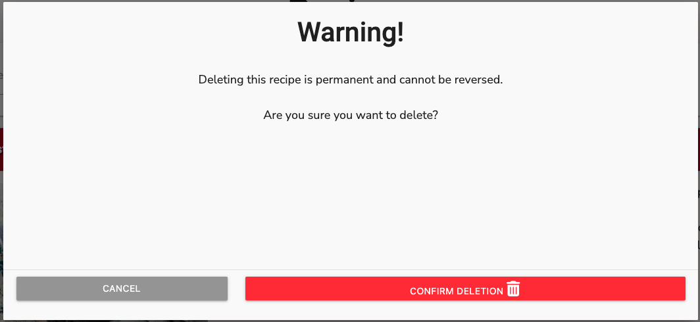

If the User __is not__ signed in, the following will be displayed:


If the User __is__ signed in, __did not__ create the recipe and __has not__ saved the recipe, the following will be displayed:


If the User __is__ signed in, __did not__ create the recipe and __has__ saved the recipe, the following will be displayed:


If the User __is__ signed in, __did__ create the recipe and __has not__ saved the recipe, the following will be displayed:

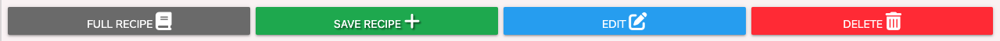

If the User __is__ signed in, __did__ create the recipe and __has__ saved the recipe, the following will be displayed:


## View/Full Recipe

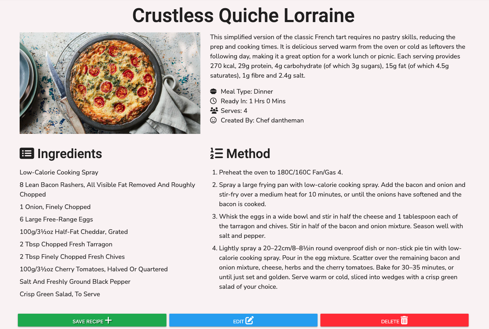

Clicking the __Full Recipe__ button on a recipe collapsible (on the 'Recipes' page or the user's profile) takes the user to a new page - in a new window - where the full version of the recipe is displayed. The information displayed is as follows:

- Recipe Name
- Recipe Image (if provided)
- Recipe Description
- Recipe Info:
  - Meal type, i.e 'Lunch', 'Dinner', etc.
  - Time to prepare and cook the recipe.
  - Number of servings.
  - Creator of the recipe.
- Recipe Ingredients
- Recipe Method
- Action Buttons:
  - __Save Recipe__ - If __not__ already saved to the user's CookBook.
  - __Forget Recipe__ - If already saved to the user's CookBook.
  - __Edit__ - If created by the user.
  - __Delete__ - If created by the user.

## Add Recipe

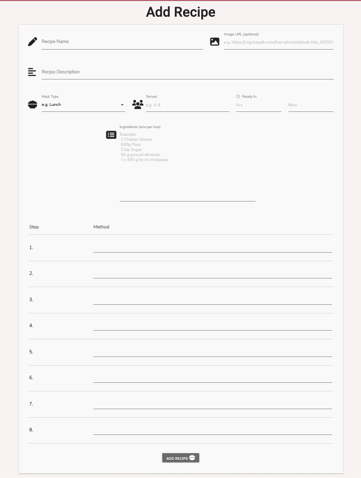

Clicking the __Add Recipe__ nav link opens its respective page, where a form to add a new recipe is displayed. The form consists of the following:

- Form Header
- Form fields:
  - Recipe Name - _required_
  - Image URL - _optional_
  - Recipe Description - _required_
  - Meal Type - _required_
  - Serves (portions) - _required_
  - Ready In (prep and cooking time) - _required_
  - Ingredients - _first line required_
  - Method - _first line required_
- Add Recipe (submit) button

Each form field has validation to meet length and format.

Submitting the form creates a new object/entry in the 'recipes' collection in the database.

The recipe-creator's username is assigned to the recipe, which is used to display the recipe in the user's 'My Recipes' tab in their profile.

## Edit Recipe

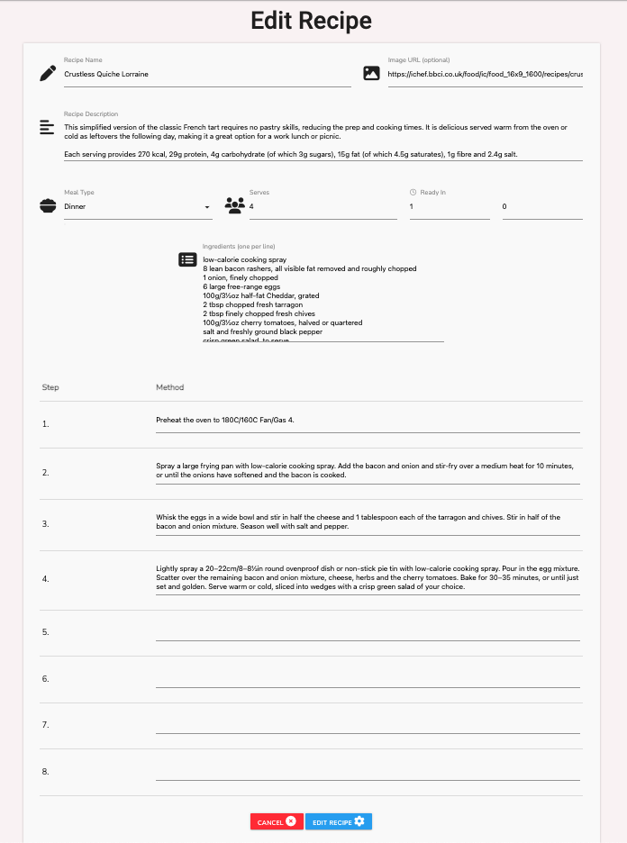

Clicking the 'Edit' button on a recipe collapsible, or the full version of the recipe, opens the 'edit_recipe' page. This page displays a form similar to the 'add_recipe' page, with a few changes:

- Form fields are prefilled with the recipe's information
- __Cancel__ button wipes any changes made to the form before submission
- __Edit Recipe__ button submits the form with the new changes
  - The recipe in the database is updated with any new information but retains any unchanged information

# Technologies Used

## Languages

- [HTML](https://en.wikipedia.org/wiki/HTML)
- [CSS](https://en.wikipedia.org/wiki/CSS)
- [JavaScript](https://en.wikipedia.org/wiki/JavaScript)
- [Python](https://en.wikipedia.org/wiki/Python_(programming_language))

## Frameworks, Libraries & Programs

- [Codeanywhere](https://app.codeanywhere.com/)
  - Codeanywhere was used for writing, committing and pushing the code to GitHub.

- [Materialize](https://materializecss.com/)
  -Materialize was used to develop a responsive mobile-first design using an assortment of templates.

- [Font Awesome](https://fontawesome.com/)
  - Font Awesome was used to add icons/images to the computer and player tiles.

- [Flask](https://flask.palletsprojects.com/en/3.0.x/)
  - Flask was used as the web application framework for use with Python.

- [Jinja](https://jinja.palletsprojects.com/en/3.1.x/)
  - Jinja was used as the templating engine for this application.

- [MongoDB](https://www.mongodb.com/)
  - MongoDB was used as the data platform for this application to perform CRUD functionality.

- [jQuery](https://jquery.com/)
  - jQuery was used as the preferred JavaScript library for HTML document traversal and manipulation, event handling and animation.

- [Chrome DevTools](https://developer.chrome.com/docs/devtools/)
  - Chrome DevTools was used throughout the development of the website to test ideas and responsiveness, as well as test functionality of the application and debug issues that arose.

- [W3C Markup Validator](https://validator.w3.org/)
  - W3C Markup Validator was used to validate the HTML code.

- [W3C CSS Validator](https://jigsaw.w3.org/css-validator/)
  - W3C CSS Validator was used to validate the CSS code.

- [JSLint](https://www.jslint.com/)
  - JSLint was used to validate the JavaScript.

- [Favicon.io](https://favicon.io/)
  - Favicon.io was used to create the site favicon.

# Testing

A large amount of testing was undertaken throughout the project in order to assess if the application was working as expected.

Friends and family also participated in testing the application's functionality and expressed any concerns or ideas they had with function, layout and user experience.

Please see a detailed breakdown of the testing carried out for this application in [TESTING.md](TESTING.md).

# Finished Product

# Deployment

This website was developed using [Codeanywhere](https://codeanywhere.com/solutions/collaborate), then committed and pushed to GitHub using the Codeanywhere terminal.

## Heroku Deployment

The project was deployed to Heroku using the following steps:

1. Create a `requirements.txt` file using the terminal command:

   ```bash
   pip freeze > requirements.txt
   ```

2. Create a `Procfile` with the terminal command:

   ```bash
   echo web: python app.py > Procfile
   ```

3. `git add` and `git commit` the new requirements and Procfile and then `git push` the project to GitHub.
4. Create a new app on the [Herkou website](https://dashboard.heroku.com/apps) by clicking the "New" button in your dashboard. Give it a name and assign the region to Europe.
5. From the Heroku dashboard of your newly created application, click on "Deploy" > "Deployment Method" and select GitHub.
6. Confirm the linking of the Heroku app to the correct GitHub repository.
7. In the Heroku dashboard for the application, click on "Settings" > "Reveal Config Vars".
8. Set the following config vars:

    | KEY | VALUE |
    | :-- | :-- |
    | IP | 0.0.0.0 |
    | PORT | 5000 |
    | SECRET_KEY | ANY_SECRET_KEY* |
    | MONGO_URI | `mongodb+srv://<username>:<password>@<cluster_name>.hrljbrx.mongodb.net/<database_name>?retryWrites=true&w=majority` |
    | DEBUG | TRUE** |

    - *Denotes a value that is specific to your app.

    - **This is set to true to enable us to see any bugs on the live site. __Please change to FALSE after deployment.__

    - To get your MONGO_URI read the MongoDB Atlas documentation [here](https://www.mongodb.com/docs/atlas/getting-started/).

9. In the Heroku dashboard, click "Deploy".
10. In the "Manual Deployment" section of this page, make sure the "Master Branch" is selected and then click "Deploy Branch".

## Local Development

### How to Fork

To fork the repository:

1. Log in (or sign up) to Github.
2. Go to the repository for this project, [My CookBook](https://github.com/DanHodgson12/my-cook-book).
3. Click the Fork button in the top right corner.

### Making a Local Clone

To clone the repository:

1. Log in (or sign up) to GitHub.

2. Go to the repository for this project, [My CookBook](https://github.com/DanHodgson12/my-cook-book).

3. In the "Clone with HTTPs" section, copy the clone URL for the repository.

4. Open the terminal in your code editor and change the current working directory to the location you want to use for the cloned directory.

5. Type `git clone`, then paste the URL you copied in Step 3, the press Enter:

    ```bash
    git clone https://github.com/DanHodgson12/my-cook-book.git
    ```

6. Install the packages from the requirements.txt file by running the following command in the Terminal:

    ```bash
    pip3 install -r requirements.txt
    ```

7. Your local clone will now be created.

# Credits

## Content

- All content was written by the developer.
- Example recipes were taken from the [BBC Food Recipe website](https://www.bbc.co.uk/food/recipes/).

## Media

- [Font Awesome](https://fontawesome.com/icons) was used for providing the icons used in the application.
- All other styling and media was created by the developer.

## Code

- [Materialize](https://materializecss.com/getting-started.html) was used throughout to help with responsiveness and styling purposes.
- [W3Schools](https://www.w3schools.com/) & [Stack Overflow](https://stackoverflow.co/teams/) were consulted on a regular basis to help overcome roadblocks in the developer's coding knowledge.
- A user's contribution to [CodePen](https://codepen.io/j_holtslander/pen/vMZGxM) was used as inspiration for the rotating caret animation for the collapsible elements on the Recipes and Profile pages.

# Acknowledgements

- My family, for their valuable opinions and unconditional support.
- My mentor, Marcel, for his encouraging feedback and patience during my learning journey.
- Code Institute, for its wonderful learning platform and supportive community.
