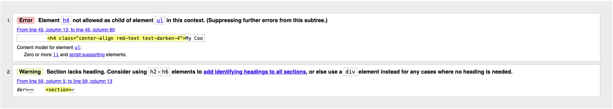

# Testing

## Testing User Stories

## Tools Testing

## Compatibility Testing

### Browser Compatibility
  
### Device Compatibility

## Common Elements Testing

### Known Bugs

## Code Validation

The [W3C Markup Validator](https://validator.w3.org/) and [W3C CSS Validator](https://jigsaw.w3.org/css-validator/) services were used to check for any code errors or misuse of syntax/elements in the HTML & CSS.

The [CI Python Linter](https://pep8ci.herokuapp.com/) service was used to check for any linting errors in the Python code.

### HTML

The W3C Markup Validator returned multiple errors and warnings with a lot of the Jinja templating language used. The developer chose to ignore these specific warnings, as this tool is primarily designed to validate static HTML and doesn't recognize server-side templating languages, including Jinja.

Other than the above, there were a few legitimate errors/warnings with the HTML on the following pages:

#### base.html

1. This is part of the Mobile Collapse Sidenav. This error was ignored as the sidenav performed without issue.
2. This section element contained the flashed messages provided using Jinja templating language. This warning was ignored as the flashed messages performed without issue.

#### add_recipe.html & edit_recipe.html

1. These errors showed up for both pages. The code targeted is being used in placeholder text for a text area - the `&#10` makes each piece of text appear on a new line. These errors were ignored as the code performed without issue.

### CSS

The W3C CSS Validator returned no errors in the code.

### Python

The CI Python Linter returned no errors in the code.

### JavaScript

## Lighthouse Report
