# Testing

## Testing User Stories

- __As__ a user, I want to be able to navigate the application easily, __so__ that I can start using the application as soon as possible.
    - __Given__ I load the web application, __when__ I look at the home page, __then__ I will be able to see the instructions for navigating the website easily.

- __As__ a user, I want to know what the application is about, __so__ that I can understand the concept behind it.
    - __Given__ I load the web application, __when__ I look at the home page, __then__ I will be able to see information explaining the purpose for the web application.

- __As__ a user, I want to see the application's instructions, __so__ that I can understand how to use it.
    - __Given__ I load the web application, __when__ I look at the home page, __then__ I will be able to see the instructions for using the website easily.

- __As__ a user, I want to be able to interact with the application, __so__ that I can have a enjoyable experience.
    - __Given__ I interact with the 'Add Recipe' page, __when__ I submit a recipe, __then__ I can see my recipe displayed amongst the others and can see it in my profile.

- __As__ a user, I want to be given feedback when I interact with the application, __so__ I know when an action I perform has been registered.
    - __Given__ I add/edit/delete/save/forget a recipe, __when__ I submit the form, __then__ I will see a flashed message at the top of the screen telling me whether or not I was successful.
    - __Given__ I register/sign in/sign out, __when__ I submit the form, __then__ I will see a flashed message at the top of the screen telling me whether or not I was successful.

- __As__ a user, I want to be able to create my own profile, __so__ I can begin using the application to its fullest.
    - __Given__ I load the Register page, __when__ I register a username and password, __then__ I see my profile created on the Profile page.

- __As__ a user, I want to be able to add my own recipes, __so__ I can share my knowledge with others.
    - __Given__ I click the Add Recipe Nav link, __when__ I add my recipe's details to the page, __then__ I will see my recipe displayed amongst the other recipes on the Recipes page.

- __As__ a user, I want to be able to access a wide range of recipes, __so__ that I can find something that I like.
    - __Given__ I load the Recipes page, __when__ I use the search bar at the top of the page, __then__ I will be able to search for a recipe by keyword.

- __As__ a user, I want to be able to edit my own recipes, __so__ that I can make changes to the recipe or fix errors if needed.
    - __Given__ I find my recipe on the Recipes page or in my profile, __when__ I click the 'Edit' button, __then__ I will be able to edit/update the details of my recipe.

- __As__ a user, I want to be able to delete my own recipes, __so__ that I can remove my information if I change my mind.
    - __Given__ I find my recipe on the Recipes page or in my profile, __when__ I click the 'Delete' button, __then__ I will be shown a warning message with a 'Confirm Deletion' button which will delete the recipe.

- __As__ a user, I want to be able to search for a specific recipe, __so__ that I can see which recipes suit my preferences.
    - __Given__ I load the Recipes page, __when__ I use the search bar at the top of the page, __then__ I will be able to search for a recipe by keyword.

- __As__ a user, I want to be able to save recipes to my profile, __so__ that I can view only the recipes that matter to me.
    - __Given__ I find a recipe I like, __when__ I click the 'Save Recipe' button, __then__ I will see the recipe saved in the 'My CookBook' tab in my profile.

- __As__ a user, I want to be able to remove recipes from my profile, __so__ that I can view only the recipes that matter to me.
    - __Given__ I find the saved recipe on the Recipes page or in my profile, __when__ I click the 'Forget Recipe' button, __then__ the recipe will be removed from the 'My CookBook' tab in my profile.

- __As__ a user, I want the web application to be responsive, __so__ that I can use the application on a variety of screen sizes.
    - __Given__ I load the web application, __When__ I load it on different screen sizes, __Then__ I will see the layout change to suit the screen size accordingly.

## Tools Testing

- [Google Chrome DevTools](https://developer.chrome.com/docs/devtools/)
  - Google Chrome DevTools was used throughout the development process to test, explore and make changes to the HTML and CSS of the webpage.
  - Google Chrome DevTools was used throughout the development process to test, explore and make changes to the JavaScript controlling certain elements being utilised from Materialize.

- Responsiveness
  - [Responsive Design Checker](https://www.responsivedesignchecker.com/) was used to check responsiveness across a variety of devices and screen sizes.
  - [Am I Responsive?](https://ui.dev/amiresponsive) was used to check responsiveness across different screen sizes and generate the mockup final image.
  - [Google Chrome DevTools](https://developer.chrome.com/docs/devtools/) was used to check responsiveness across different screen sizes during the development and testing phases.

## Compatibility Testing

### Browser Compatibility

Browser | Outcome | Pass/Fail
--- | --- | ---
Google Chrome | No appearance, responsiveness or functionality issues | Pass
Safari | No appearance, responsiveness or functionality issues | Pass
Mozilla Firefox | No appearance, responsiveness or functionality issues | Pass
Microsoft Edge | No appearance, responsiveness or functionality issues | Pass
  
### Device Compatibility

The web application was tested across a wide variety of devices using [Google Chrome DevTools](https://developer.chrome.com/docs/devtools/) & [Responsive Design Checker](https://www.responsivedesignchecker.com/) - no appearance, responsiveness or functionality issues were found.

## Common Elements Testing

### Navbar

#### Logo/Header Functionality

Outcome | Pass/Fail
--- | ---
Logo and header both reload the home page when clicked, as expected | Pass

#### Nav Links Displayed

Status | Links Displayed | Pass/Fail
--- | --- | ---
Signed Out | Home - Recipes - Sign In - Register | Pass
Signed In | Home - Recipes - Add Recipe - Sign Out - Profile | Pass

#### Nav Links Functionality

Link | Outcome | Pass/Fail
--- | --- | ---
Home | Takes user to the Home page as expected | Pass
Recipes | Loads the Recipes page as expected | Pass
Add Recipe | Takes user to the Add Recipe page as expected | Pass
Sign In | Takes user to Sign In page as expected | Pass
Sign Out | Signs the user out as expected | Pass
Register | Takes user to the Register page as expected | Pass
Profile | Takes user to their profile as expected | Pass

### Home

Outcome | Pass/Fail
--- | ---
Text displayed clearly with no formatting issues | Pass
Sign In button takes user to Sign In page as expected | Pass
Register button takes user to Register page as expected | Pass
Recipes button takes user to Recipes page as expected | Pass

### Recipes

#### Collapsibles

Outcome | Pass/Fail
--- | ---
All recipes from database are displayed in collapsible elements as expected | Pass
First recipe collapsible is automatically displayed when page loads | Pass
All collapsible headers are clickable and expand/collapse body as expected | Pass
Last clicked collapsible closes when a new collapsible is opened as expected | Pass
Collapsible's caret icon rotates 90 degrees when expanded or collapsed as expected | Pass
Recipe image and text displayed correctly with no formatting or responsiveness issues | Pass
All recipe action buttons displaying appropriately according to user status and recipe-ownership | Pass

#### Action Buttons

Button | Outcome | Pass/Fail
--- | --- | ---
Full Recipe | Opens full version of recipe in a new window as expected | Pass
Save Recipe | Successfully saves recipe to 'My CookBook' in user's profile | Pass
Forget Recipe | Successfully removes recipe from 'My CookBook' in user's profile | Pass
Edit | Takes user to the Edit Recipe page as expected | Pass
Delete | Opens warning modal with option to cancel or confirm deletion as expected | Pass

#### Search Bar

Outcome | Pass/Fail
--- | ---
Successfully renders recipes related to keyword or keywords | Pass
__Cancel__ button clears search bar as expected | Pass
__Search__ button executes search function as expected | Pass

### View/Full Recipe

#### Content

Outcome | Pass/Fail
--- | ---
Recipe image and text displayed correctly with no formatting or responsiveness issues | Pass
Ingredients rendering correctly from database | Pass
Method rendering correctly from database | Pass
All recipe action buttons displaying appropriately according to user status and recipe-ownership | Pass

#### Action Buttons

Button | Outcome | Pass/Fail
--- | --- | ---
Save Recipe | Successfully saves recipe to 'My CookBook' in user's profile | Pass
Forget Recipe | Successfully removes recipe from 'My CookBook' in user's profile | Pass
Edit | Takes user to the Edit Recipe page as expected | Pass
Delete | Opens warning modal with option to cancel or confirm deletion as expected | Pass

### Add Recipe

Outcome | Pass/Fail
--- | ---
An animation and message for validation displays if no text entered in required fields | Pass
An animation and message for validation displays if incorrect length or format of information entered in all fields | Pass
__Add Recipe__ button at bottom of form successfully creates new recipe in database | Pass
Newly added recipe displays as a collapsible element on Recipes page with appropriate information and action buttons | Pass

### Edit Recipe

Outcome | Pass/Fail
--- | ---
All form fields render current recipe information when page is loaded as expected | Pass
All form fields maintain the same validation requirements as Add Recipe as expected | Pass
Submitting form with __Edit Recipe__ button updates the recipes current information with new information in database | Pass
__Cancel__ button prevents recipe's information from changing, even if information has been adjusted before submitting form | Pass

### Delete Recipe

Outcome | Pass/Fail
--- | ---
Modals are opened upon clicking any __Delete__ button across application to prevent accidental deletion | Pass
Delete function successfully removes recipe from database and is no longer displayed anywhere across application | Pass
If recipe has been saved to user's CookBook, the recipe's ID is also removed from user's data in database | Pass

### Save Recipe

Outcome | Pass/Fail
--- | ---
Adds ID of recipe to user object in database as expected | Pass
Successfully renders recipe in 'My CookBook' tab in user's profile | Pass

### Forget Recipe

Outcome | Pass/Fail
--- | ---
Removes ID of recipe from user object in database as expected | Pass
Successfully removes recipe from 'My CookBook' tab in user's profile | Pass

### Sign In

Outcome | Pass/Fail
--- | ---
An animation and message for validation displays if no text entered in Username or Password field | Pass
Submitting the form successfully checks if the username and password belong to the same user | Pass
Submitting the form with correct information signs the user in and takes them to their Profile | Pass
Submitting the form with correct information displays the appropriate flash message at the top of the screen | Pass
Submitting the form with incorrect information prevents user from signing in | Pass
Submitting the form with incorrect information displays a warning flash message at the top of the screen | Pass
Warning flash message indicates either Username or Password incorrect | Pass
Register button in reminder underneath Sign In form takes user to the Register page as expected | Pass

### Sign Out

Outcome | Pass/Fail
--- | ---
Sign Out nav link signs user out and displays correct flashed message as expected | Pass

### Register

Outcome | Pass/Fail
--- | ---
An animation and message for validation displays if no text entered in Username or Password field | Pass
An animation and message for validation displays if incorrect length or format of information is entered in Username or Password field | Pass
Submitting the form with a username already in use prevents user from registering | Pass
Submitting the form with a username already in use displays the appropriate flash message at the top of the screen | Pass
Submitting the form with correctly formatted information creates the user in the databse and takes them to their Profile | Pass
Submitting the form with correctly formatted information displays the appropriate flash message at the top of the screen | Pass
Register functionality successfully hashes the user's password and displays as encrypted in the database | Pass
Sign In button in reminder underneath Register form takes user to the Register page as expected | Pass

### Profile

Outcome | Pass/Fail
--- | ---
Username displayed correctly in header | Pass
Renders user's created recipes in 'My Recipes' tab as expected | Pass
Collapsibles in 'My Recipes' tab rendered identically to those on Recipes page as expected | Pass
Renders user's saved recipes in 'My CookBook' tab as expected | Pass
Collapsibles in 'My CookBook' tab rendered identically to those on Recipes page as expected | Pass

### Known Bugs

There are no known bugs with the web application.

## Code Validation

The [W3C Markup Validator](https://validator.w3.org/) and [W3C CSS Validator](https://jigsaw.w3.org/css-validator/) services were used to check for any code errors or misuse of syntax/elements in the HTML & CSS.

The [JSHint](https://jshint.com/) service was used to check for any code errors or misuse of syntax in the JavaScript.

The [CI Python Linter](https://pep8ci.herokuapp.com/) service was used to check for any linting errors in the Python code.

### HTML

The W3C Markup Validator returned multiple errors and warnings with a lot of the Jinja templating language used. The developer chose to ignore these specific warnings, as this tool is primarily designed to validate static HTML and doesn't recognize server-side templating languages, including Jinja.

Other than the above, there were a few legitimate errors/warnings with the HTML on the following pages:

#### base.html

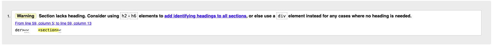

- This section element contained the flashed messages provided using Jinja templating language. This warning was ignored as the flashed messages performed without issue.

#### add_recipe.html & edit_recipe.html

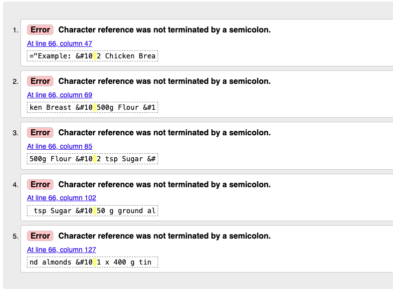

- These errors showed up for both pages. The code targeted is being used in placeholder text for a text area - the `&#10` makes each piece of text appear on a new line. These errors were ignored as the code performed without issue.

### CSS

The W3C CSS Validator returned no errors in the code.
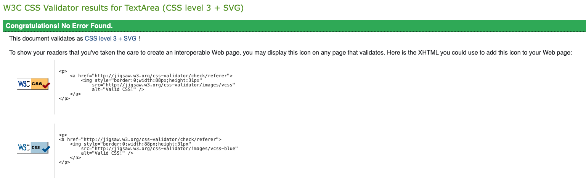

### JavaScript

The JSHint Validation returned a few errors in the code for undefined variables:

- `$` - This was ignored as it is required for functions using jQuery.
- `M` - This was ignored as it is used for initialisation whilst using Materialize.

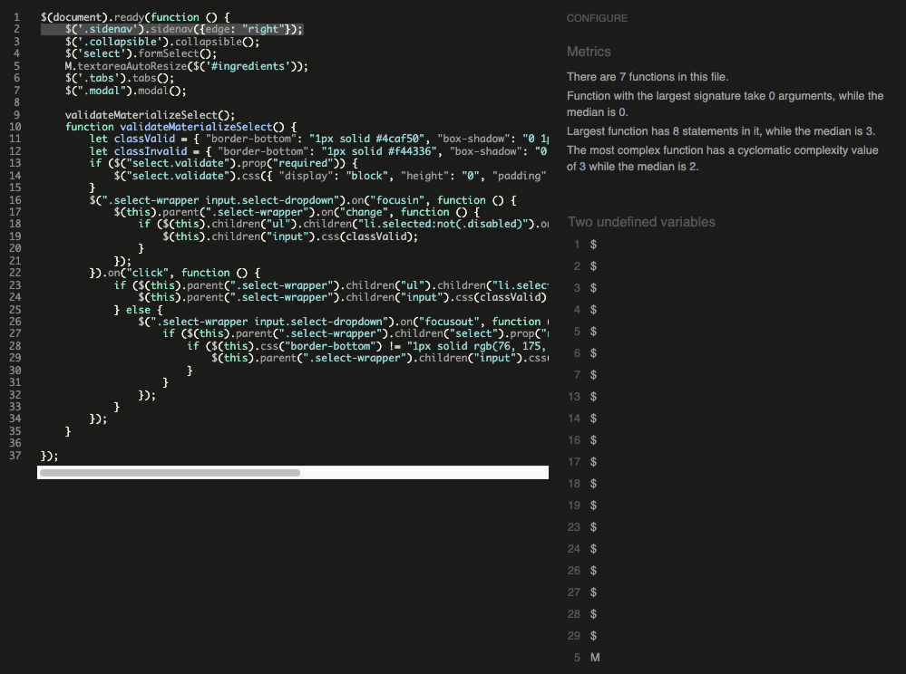

### Python

The CI Python Linter returned no errors in the code.
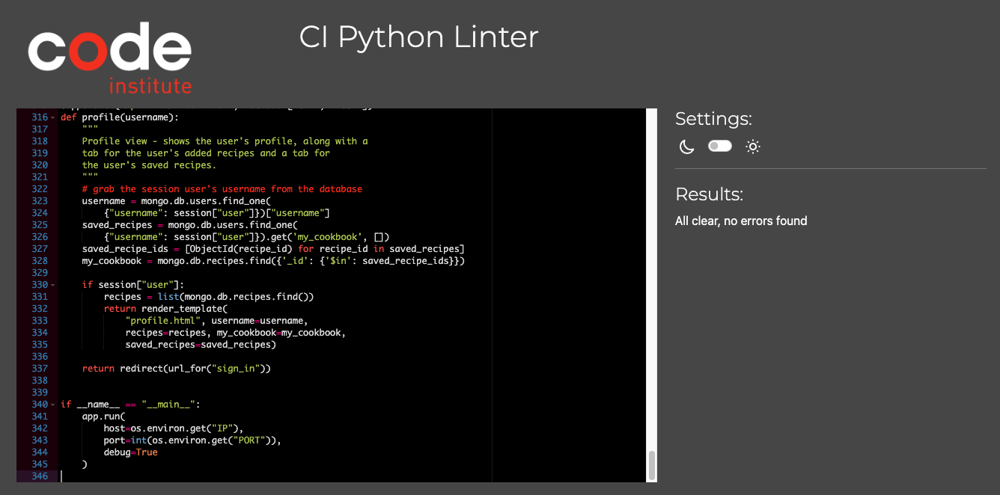

## Lighthouse Report

Lighthouse in Google Chrome Dev Tools was used to test performance, accessibility, best practices and search engine optimisation of the webpage.

Suggestions were made to optimise SEO by adding 'meta' tags to each page. However, this was ignored as meta tags were included in the base template and were being duplicated via Jinja.

Page | Report
--- | ---
Home | 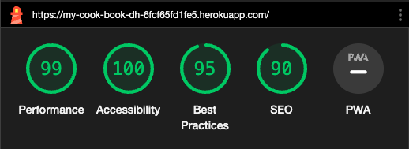
Recipes | 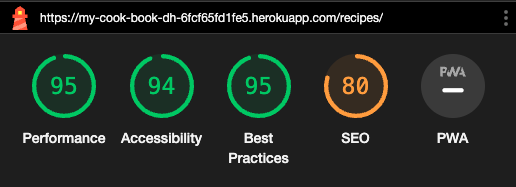
Add Recipe | 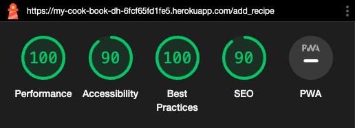
Edit Recipe | 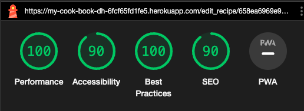
Sign In | 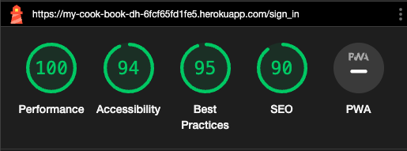
Register | 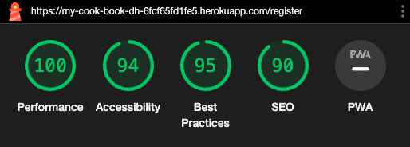
Profile | 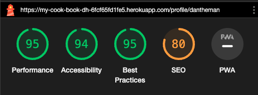